# KopiKita — Coffee Shop Website

KopiKita adalah website coffee shop yang dibangun menggunakan **HTML**, **Tailwind CSS**, dan **JavaScript Vanilla**. Proyek ini bertujuan memberikan pengalaman pengguna yang modern, responsif, dan interaktif di berbagai perangkat.

## Fitur Utama
- **Navigasi Responsif**: Navbar mendukung tampilan desktop dan mobile.
- **Halaman About**: Informasi lengkap tentang KopiKita.
- **Katalog Produk**: Pilihan kopi dengan desain menarik.
- **Metode Pembayaran**: Mendukung QRIS, transfer bank, dan dompet digital.
- **Animasi Halus**: Efek animasi menggunakan AOS (Animate On Scroll).
- **Slider Interaktif**: Ulasan ahli menggunakan Swiper.js.

## Teknologi yang Digunakan
- **HTML**: Struktur dasar halaman.
- **Tailwind CSS**: Styling cepat dan responsif.
- **JavaScript Vanilla**: Interaktivitas seperti navigasi, slider, dan animasi.
- **AOS (Animate On Scroll)**: Animasi saat scroll.
- **Swiper.js**: Slider produk dan ulasan.

## Tampilan Website

Berikut adalah beberapa tampilan dari website KopiKita:

<p align="left">
    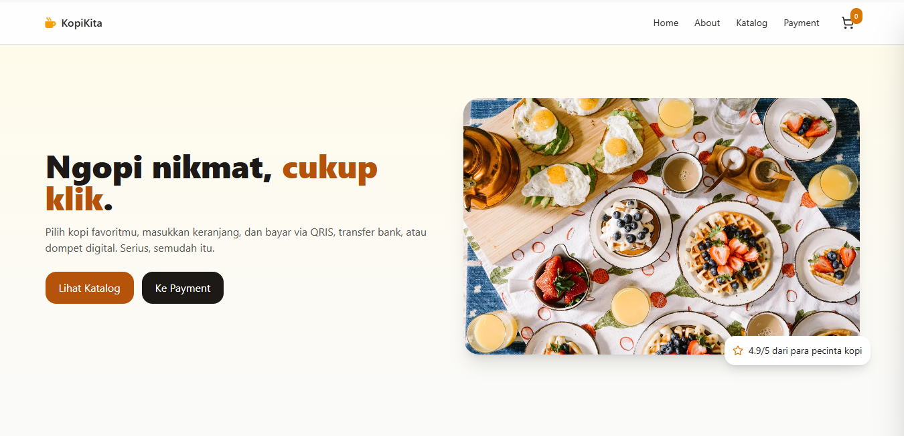
    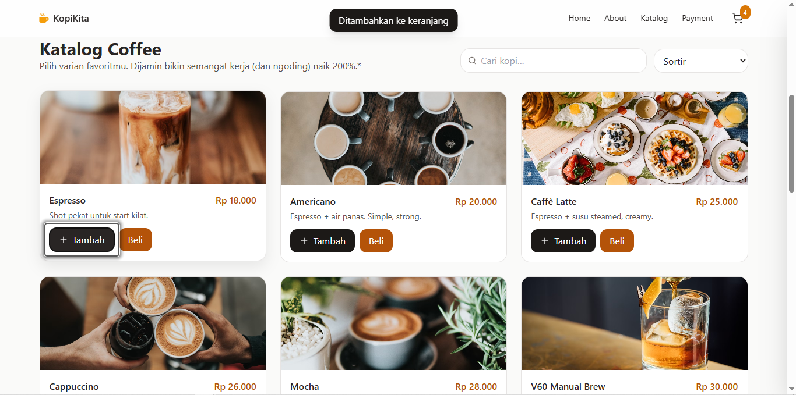
    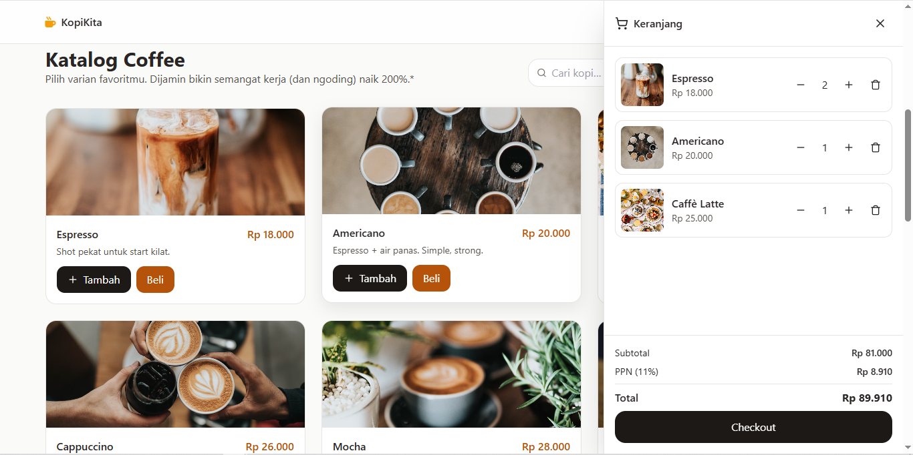
    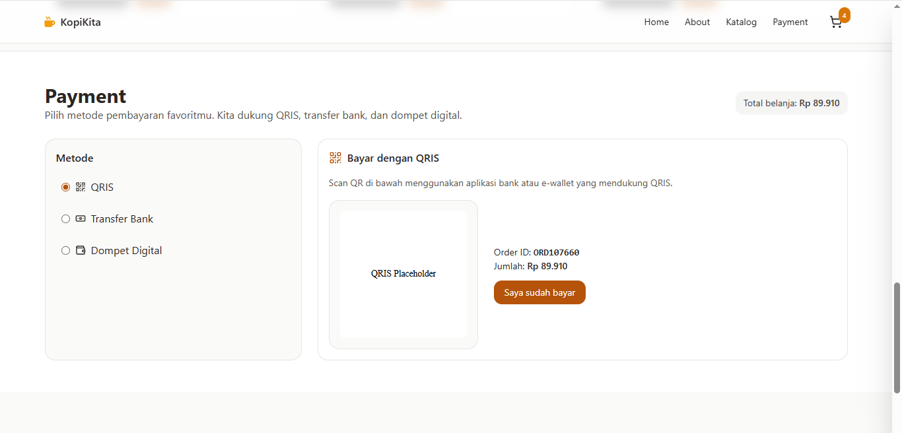
    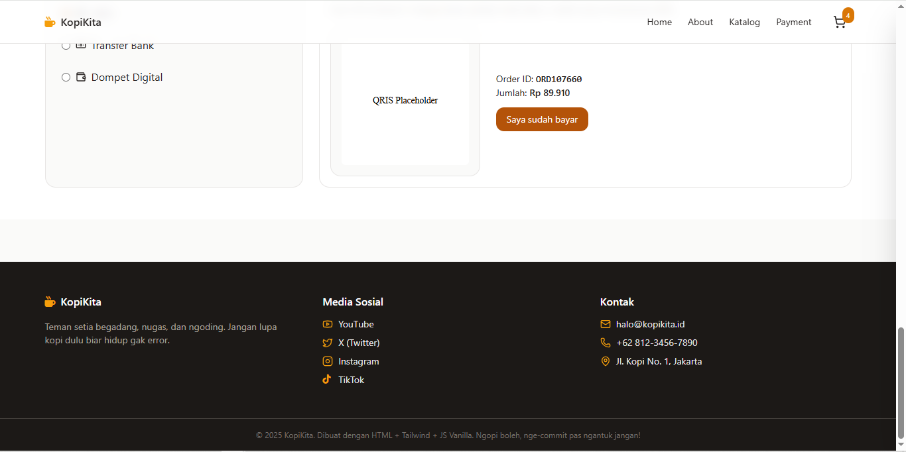
    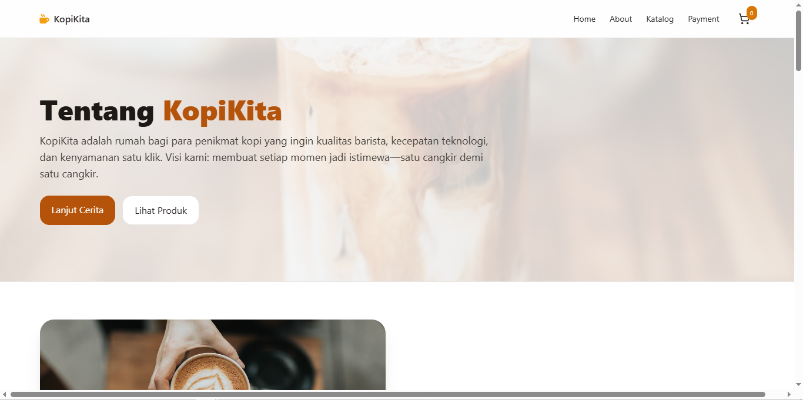
    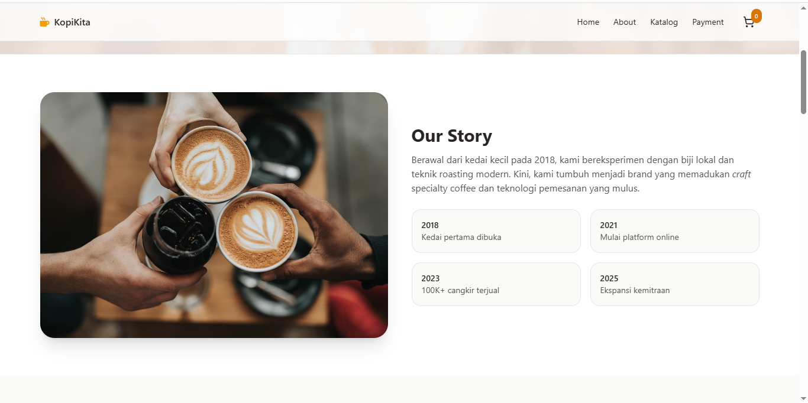
    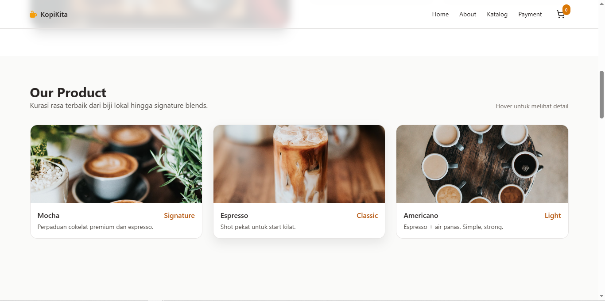
    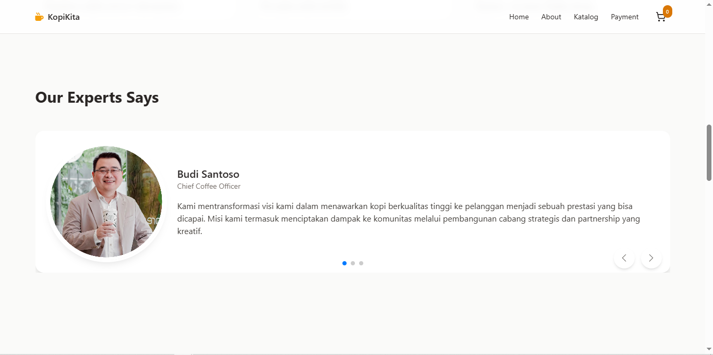
    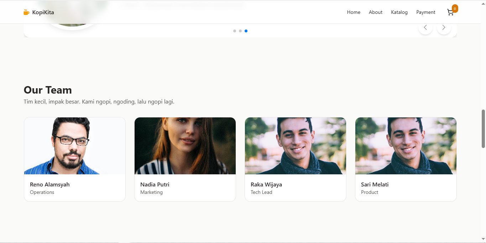
    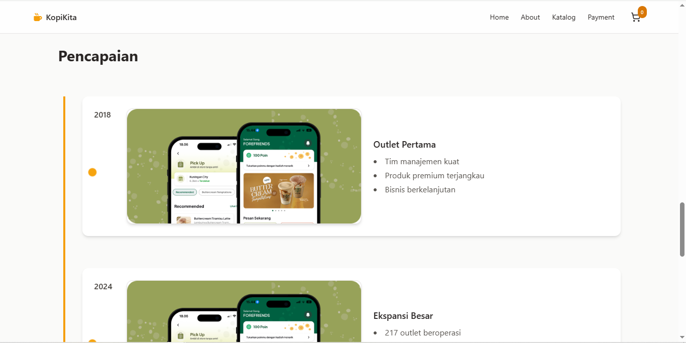
</p>

## Cara Menjalankan Proyek

1. **Clone repository ini ke komputer Anda:**
    ```bash
    git clone https://github.com/AhmadArifff/Coffee-Shop_HTML-Tailwind.git
    ```

2. **Masuk ke folder proyek:**
    ```bash
    cd Coffee-Shop_HTML-Tailwind
    ```

3. **Buka file `index.html` di browser Anda untuk melihat website.**

## Struktur Folder

```plaintext
Coffee-Shop_HTML-Tailwind/
│
├── index.html         # Halaman utama
├── about.html         # Halaman About
├── README.md          # Dokumentasi proyek
├── Screensho/         # Folder gambar tampilan
│   ├── home.png       # Screenshot halaman Home
│   ├── about.png      # Screenshot halaman About
└── ...
```